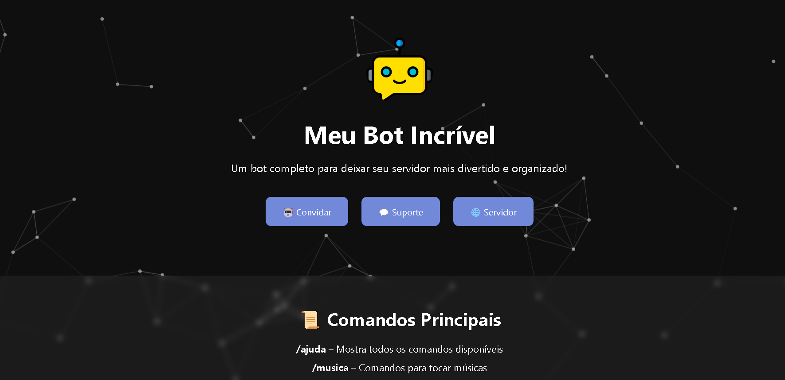
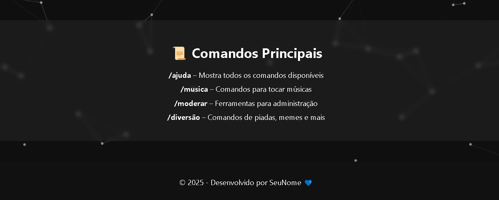

# 📄 Documentação do Site para Bot de Discord

Este projeto é um **site institucional para um bot de Discord**, criado com **HTML, CSS e JavaScript puro**, com foco em leveza, animações modernas e apresentação clara das funcionalidades do bot.

## 📦 Estrutura do Projeto

```
/
├── index.html       # Página principal do site
├── style.css        # Estilo visual e responsividade
├── script.js        # Partículas e interações visuais
└── README.md        # Documentação
```

## 🔧 Requisitos

Nenhuma instalação local é necessária. Todos os recursos são carregados por CDN.

### Bibliotecas utilizadas:

| Biblioteca       | Finalidade                      |
|------------------|----------------------------------|
| Particles.js     | Fundo animado com partículas     |
| Animate.css      | Animações suaves em elementos    |
| Font Awesome     | Ícones em botões e seções        |

## 🧱 Componentes

- `index.html`: estrutura da página
- `style.css`: layout moderno e responsivo
- `script.js`: fundo animado com partículas

## 🚀 Como usar

1. Clone ou baixe os arquivos
2. Abra `index.html` no navegador
3. Personalize as seções de acordo com seu bot

## 🌐 Publicar no GitHub Pages

1. Crie um repositório
2. Suba os arquivos
3. Vá em **Configurações > Pages** e ative
4. Acesse: `https://seunome.github.io/seu-repositorio`

## 🍙・Hospedagem usada:
- [Shop Host Brasil](https://shophostbrasil.com.br)

## ・Imagens:




## 👨‍💻 Autor
Desenvolvido por Danielluiz2016  
&copy; 2025
